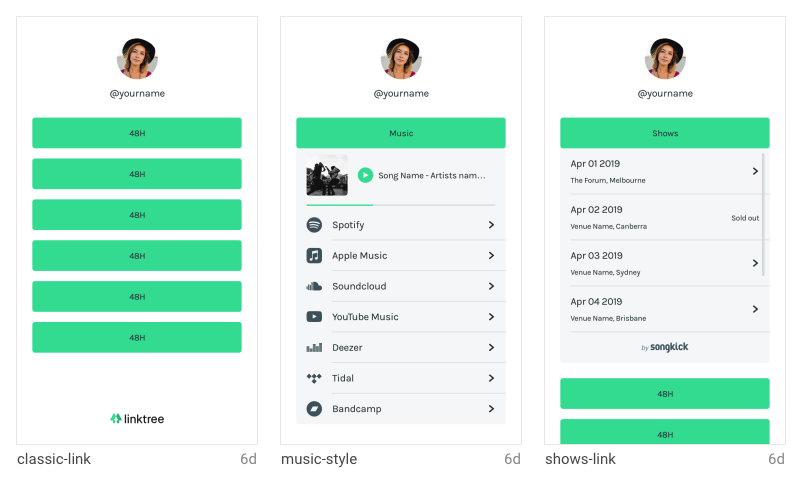

# Links Practice

To start the application run the following:

`npm install`

`npm start` 

View on `localhost:3000`

To run tests

`npm test`

## Considering the structure of the application

I want to build the application in way in the future, it that allows the user to choose the order of their links. I am not building this feature but I want to make sure that if it was built in the future as a likely user need that the links are not tightly coupled to the type of link that it is. This issue could easily occur with the following logic: 
``` classicLinks.map(classicLink => return classicLink) ``` 

We do not want to trap a link within its type. Especially if we were to validate the presence of any classic link before rendering all classic links like so 
```{ classicLinkPresent && <ClassicLinksList/>}```

Instead we want to render the links based on the assumption of a user preference array.

1. user has list of links (Starting point of this application)
2. user chooses order of links (not build into this project)
3. links display in order of user choice 

This consideration as affected the structure of this application and currently links return in the order of the data object. This allows for the preference logic to be done in either the front or backend.

## Hindsight
I noticed at the end there is the requirement of one link opening should cause the other link to close. This means the logic for the opening and closing buttons should have been on a level higher. This would involve a considerable but definitely useful refactor in the long term. 

Additionally there could be another wrapper in the showsList component as it currently returns as each individual show which makes it a bit of a refactor to get the songkick logo in there. There is certainly room for refactoring as there are divs that can be removed in each component. 

More tests can certainly be written and adding the music player component would be next if I had more time. Additionally, git commit messages are a very basic example of the conventional commit style that I use typically in more detail. I have found this depends on the team you are working in and their requirements.

-----------------------------------------------------------------------------------------------




## The Problem


1. Classic

   - Accepts a single URL and title.
   - Opens the URL in a new tab.

2. Music Player

   - On click, the link type displays a set of links to music streaming platforms where you can find the song.
   - Clicking on an element inside of the Music Link will open an audio player for that song.
   - Clicking on the logo of the platform will take you to that song, on that platform.

3. Shows List
   - On click, the link type displays a list of links to upcoming events.
   - Clicking on an upcoming event will navigate to the event in SongKick.

You are required to build the profile UI and the front end components for the new features as per the assets mentioned below (Front End Assets).

## Design Considerations

- All links are globally themed by the users preferences (usually available via API e.g `{ backgroundColor: "rebeccapurple", color: "palegoldenrod" }`).
- All links invert colour on hover.

## Front End Assets

All assets are supplied with in the [/assets](./assets) dir in this repo.
You can import fonts from [Google Fonts](https://fonts.google.com/).

## Testing

Some level of testing is expected for your solution. As a guide, try to meet these three acceptance criteria.

1. "When a user clicks on a Music Player Link, the Spotify streaming platform is visible"

2. "When a user clicks on the Shows List Link, a list of X shows are visible"

3. "When a user clicks on the Music Player Link and then on a Shows List Link, the Music Player Link closes"

## Your Solution

- Consider re-usability through composition.
- Consider that profiles can be custom styled by each user.
- You are not expected to fully complete this challenge, so `@todo` comments are encouraged. How you design your solution and your ideas for the future are more important than functionality.

## Rules & Tips

- Use of frameworks such as VueJS or ReactJS will be looked upon favourably.
- You cannot connect to a real world API - mock any data sets that you require.
- Imagine that this is shared repo and factor that into the development process.

## Submission

Clone this repo and make commits as you would in your day to day work. Send your Linktree contact an email to let us know when you're finished.

Best of luck! :rocket: :blush:
